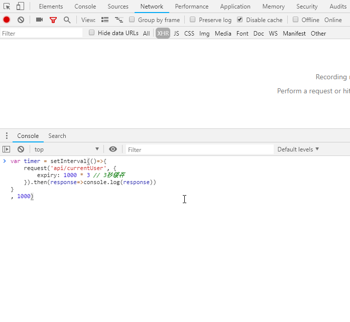

# 基于antd和umi的前端架构设计

* [技术选型](#技术选型)
* [环境搭建](#环境搭建)
* [启动说明](#启动说明)
* [命令](#命令)
* [发布](#发布)
* [目录结构](#目录结构)
* [路由和菜单](#路由和菜单) 
* [权限管理](#权限管理)     
* [数据mock](#数据mock) 
* [国际化](#国际化) 
* [数据流方案](#数据流方案) 
* [组件](#组件) 
    * [小颗粒组件](#小颗粒组件) 
    * [大颗粒组件](#大颗粒组件) 
* [兼容性](#兼容性) 
* [主题配置](#主题配置) 
* [异步方法封装](#异步方法封装) 
* [动态加载组件](#动态加载组件) 
* [umi约定](#umi约定) 
* [z-index](#z-index) 
* [自定义图标](#自定义图标) 
* [代码规范](#代码规范) 
* [eslint](#eslint) 
* [常见eslint错误](#常见eslint错误) 
* [集成与被集成](#集成与被集成) 
* [样式主题](#样式主题) 
* [其他](#其他)

## 技术选型

| 类型       | 名称                                                                                                                                                                                                                                   |
| :--------- | :------------------------------------------------------------------------------------------------------------------------------------------------------------------------------------------------------------------------------------- |
| MVVM       | [react@16.8.3](https://reactjs.org/)                                                                                                                                                                                                   |
| 视图框架   | [antd@3.13.0](https://ant.design/index-cn)、[pro-antd@2.0.0](https://pro.ant.design/index-cn)                                                                                                                                          |
| 数据流方案 | [dva@2.0](https://dvajs.com)                                                                                                                                                                                                           |
| 构建工具   | [umi@2.6.13](http://umijs.org)                                                                                                                                                                                                         |
| 其     他  | [less](http://www.css88.com/doc/less/)、[css modules](http://www.ruanyifeng.com/blog/2016/06/css_modules.html)、[lodash](http://www.css88.com/doc/lodash/)、[jquery](http://www.css88.com/jqapi-1.9/)、[moment](https://momentjs.com/) |


## 环境搭建

1. 安装 [NodeJS](https://nodejs.org/en/)。__确保 node 版本是 >=10.0.0 。

安装完成后，执行下面的命令确认是否安装成功。

```
node -v
npm -v
```

__统一__ 使用 yarn 管理 npm 依赖：

```
npm i yarn -g
```

2. 下载依赖包

```
yarn install
```

注：如果用的是svn,install成功后会在目录下生成`yarn-offline-mirror`和`node_modules` 文件夹，记得把他们添加到忽略名单，无需提交到版本库。git无需关注。

3. 安装IDE插件

以vscode 为例，需安装下列3个插件

+ Prettier - Code formatter 插件
+ EditorConfig for VS Code 插件

至此，环境配置完毕！

## 启动说明

1.  `npm run dev`启动
2. 登录账号密码  admin/123

## 命令

```
npm run dev             // 以开发模式启动
npm run dev:no-mock     // 以开发模式启动(无mock)
npm run prettier        // 格式化src下的.js .jsx .ts .less，以及config和scripts下的.js文件并保存
npm run analyze         // 分析bundle构成,分析依赖模块的体积分布
npm run build           // 打包生产代码
npm run build API_HOST=http://www.baidu.com  // 打包时request 会取这里的值来补全apiurl
npm run dev API_HOST=http://www.baidu.com  // 打包时request 会取这里的值来补全apiurl
npm run lint           // 检验src下的.js .jsx .ts .less
npm run lint:fix       // 检验并修复src下的.js .jsx .ts .less
```

## 发布

命令行执行`npm run build`，会在根目录生成`dist`文件夹。把`dist`提交到服务器即可。

注：在编译前，可以通过`npm run build API_HOST=http://www.baidu.com` 指定异步请求的host部分。具体逻辑如下：

```javascript
{
  url: /^http(s)?:\/\//.test(url) ? url : window['API_HOST'] + url
}
```

## 目录结构

 🔒 表示文件（夹）名是umi的约定关键字

```javascript
|--- config                              🔒
|    |--- config.js                      🔒 umi 配置，同 .umirc.js，二选一   
|--- mock                                🔒 mock 文件所在目录
|--- public                              🔒
|--- dist                                # 源码编译生成的目录                  
|--- src                                 🔒 源码目录                  
|    |--- pages                          🔒
|    |    |--- Log                       # 业务模块1：日志管理
|    |    |    |--- models               🔒 
|    |    |    |    |--- log.js          # 业务级的models是局部作用域，数据不涉及模块间共享时，建议放在模块目录下
|    |    |    |--- services             🔒 
|    |    |    |    |--- log.js          # 业务级 异步请求服务
|    |    |    |--- css
|    |    |    |    |--- index.less      # 业务级样式
|    |    |    |--- img
|    |    |    |    |--- xx.jpg          # 业务级图片资源
|    |    |    |--- index.js             # 视图
|    |    |    |--- _mock.js             🔒 业务级mock
|    |    |    |--- ...
|    |    |--- Tasks                     # 业务模块2
|    |    |--- User                      # 业务模块3
|    |    |--- document.ejs              # HTML模板
|    |--- layouts                        # 布局模板                
|    |    |--- BasicLayout.js                   
|    |    |--- UserLayout.js               
|    |--- components                     # pro-antd组件                
|    |    |--- Charts                   
|    |    |--- Exception               
|    |--- assets                         # 静态资源 
|    |--- utils                          # 工具方法                
|    |--- models                         🔒 数据模型                
|    |--- services                       🔒 异步请求服务                
|    |--- locales                        🔒 国际化                
|    |--- defaultSettings.js             # 项目配置，可设置主题色、异步超时时长、菜单宽度等                
|    |--- global.js                      🔒 全局JS                
|    |--- global.less                    🔒 约定的全局样式，自动引入                 
|--- .editorconfig                       🔒 与支持EditorConfig 插件的IDE协同，达到一个配置适配多种IDE的目的
|--- .eslintignore                       🔒 
|--- .eslintrc.js                        🔒 
|--- .gitignore                          🔒 
|--- .prettierignore                     🔒 
|--- .prettierrc                         🔒
|--- .stylelintrc.json                   🔒
|--- .jsconfig.json                      🔒 
|--- package.json                        🔒 依赖包配置文件
|--- yarn.lock                           🔒 锁定依赖版本号，yarn install时会按里面记录的版本安装 
```

### 命名规范

目录和文件名均采用 __驼峰结构__ 

目录名：pages下存放react组件的，首字母大写

文件名：js类型如果是 __react组件__ 首字母大写(index.js除外)，其他js以及其他类型(less、jpg，ejs)首字母小写。

[更多说明]（https://umijs.org/zh/guide/app-structure.html）

## 路由和菜单

### 路由

`路由管理` 通过约定的语法根据在 _config/router.config.js_ 中配置路由。

`菜单生成` 根据路由配置来生成菜单。菜单项名称，嵌套路径与路由高度耦合。

```javascript
  // 前3项是必填，后两项选填
  {
    path: '/roleManage',
    name: 'roleManage',
    component: '/RoleManage',
    icon: 'usergroup-add',
    hideInMenu: true,
    authority:['admin','guest']
  }
```

`name` 和 `icon`分别代表生成菜单项的文本(name对应国际化文件上的key)和图标。

`authority` 表示当前菜单的权限，如果配置了将会验证当前用户的权限(用户登录成功后 保存在localStorage中的 _antd-pro-authority_ 表示当前用户的权限)，并决定是否展示。

`hideInMenu` true表示当前菜单不会出现在左侧菜单中

### 菜单

菜单根据 _router.config.js_ 生成，具体逻辑在 _src/layouts/BasicLayout_ 中的 `formatter` 方法实现。

如果页面内容是由iframe内容组成的，则需要加上`iframe`属性，后面的值即时url的绝对地址，如下：

配置多个这样的iframe页面，componet 统一指向`IframeWrapper`组件即可

```javascript
      {
        path: '/bd',
        name: 'bd',
        icon: 'dashboard',
        component: '../components/IframeWrapper/index',
        iframe:'http://www.baidu.com'
      },
```

[更多介绍](https://pro.ant.design/docs/router-and-nav-cn)

## 权限管理

[https://pro.ant.design/docs/authority-management-cn](https://pro.ant.design/docs/authority-management-cn)

## 数据mock

`npm run dev` 默认启动的是Mock模式。除了可以模拟POST\GET\请求之前，还可以模拟500、404等错误。

引入[Mock.js](http://mockjs.com/)可以让数据更逼真。

引入[roadhog-api-doc](https://github.com/nikogu/roadhog-api-doc) 可以模拟延迟返回

Mock语法如下:

```javascript
export default {
  // 支持值为 Object 和 Array
  'GET /api/users': { users: [1, 2] },

  // GET POST 可省略
  '/api/users/1': { id: 1 },

  // 支持自定义函数，API 参考 express@4
  'POST /api/users/create': (req, res) => {
    res.status(200).send({
      resultCode: '0',
      resultMsg: '成功',
      resultObject: {
        name: 'Mr.Lin',
        userid: '00000001',
      },
    });
  },
};
```
[更多用法点击这里](https://pro.ant.design/docs/mock-api-cn)

## 国际化

当前暂且只支持`zh-CN`和`en-US`。__建议按模块组织__

配置中文包 _src/locales/zh-CN.js_

```javascript
export default {
  'menu.dashboard': '首页'
}
```

调用

```javascript
import { FormattedMessage} from 'umi/locale';

export default () => {
  return <div><FormattedMessage id="menu.dashboard" /></div>
}
```

可通过`src/defaultSettings.js`中的 _language_ 或 _baseNavigator_ 设置默认语言。

手动切换语言时，会在localStorage中保存 _umi_locale_ 字段。

[更多用法](https://pro.ant.design/docs/i18n-cn)

> 注 ： 在每个异步请求头包含自定义字段language，用于标识当前的语言环境。如：language: 'zh-CN | en-US'

## 数据流方案

[React间组件的通信机制](https://github.com/sunyongjian/blog/issues/27)是单向向下逐级分发，在应对复杂项目时显得捉襟见肘。所以，需要引入一种数据流方案。我们采用的是基于[redux](https://github.com/reduxjs/redux)和[redux-saga](https://github.com/redux-saga/redux-saga)的dva数据流方案。

数据流转描述如下：

1. 用`connect`方法把`model`和`component`链接起来
2. 页面事件触发，开始 `dispatch` `action`
3. `action`到达`model`中的`effects`中间件
4. 中间件获取数据，通过`put`方法把数据流转到指定的`reducer`
5. `reducer`改变state后重新注入组件
6. 组件的props被改变，触发页面重新渲染


model、dispatch、action、reducer和effects都是redux中的重要概念

[Dva概念](https://dvajs.com/guide/concepts.html) | [Dva快速上手](https://www.yuque.com/ant-design/course/abl3ad) | [为什么要用redux](https://segmentfault.com/a/1190000012142449)


## 兼容性

兼容IE9+，以及其他现代浏览器

针对IE9的样式统一定义在 _src/fix-ie9.less_

已知IE9问题

- Upload组件 不支持file.size 无法限制附件上传大小

## 主题配置

可以通过配置`defaultSettings.js`文件快速更改主题效果

```javascript
module.exports = {
  name: 'xxx企业门户', // 项目的名字
  language: 'zh-CN', //表示默认的语言，暂且支持 'zh-CN' 'en-US'。在baseNavigator=true时失效
  baseNavigator: true, //true 表示用navigator.language的值作为默认语言。优先级比language高，比localStorage内的umi_locale低
  timeout: 1000 * 60, //1分钟超时
  footer: 'Copyright©1999-2019 中国移动 版权所有', // footer中显示的字, 可以嵌入html标签
  siderWidth: 200, //侧边栏宽度
  fixSiderbar: true, // sticky siderbar
  delay: 300, //mock接口延迟返回的时长，单位毫秒
  breakpoint: 'xxl', // 根据视窗宽度,自动收起侧边栏的发展，还支持：xs: '480px', sm: '576px',md: '768px',lg: '992px',xl: '1200px',xxl: '1600px'
  navTheme: 'dark', // theme for nav menu
  iconfontUrl:'', //引入Iconfont 自定义图标 用法参考 https://github.com/ant-design/ant-design-pro/pull/3517
}
```

## 异步方法封装

因为需要兼容低版本浏览器IE9，所以放弃使用fetch类的库,（如：Axios,isomorphic-fetch等）。而直接引入jquery，但进行了二次封装。

### 封装内容 

一、约定回参格式，主动提示请求错误。

```javascript
{
  resultCode:"0",
  resultMsg:"成功返归约定数据",
  resultObject:{}
}
```

主动提示会发生于下列两种场景：

1. 异步服务出错时。如：500,404等，提示信息由 _url_, _http code_ 和 _code含义_ 组成。
2. 在resultCode非0时。提示信息来源 _resultMsg_ 。(可通过showError=false 拦截这种提示)

二、扩展了3个属性：_expiry_，_showMask_ 和 _showError_。其中设置 **expiry** 可以缓存数据。根据场景合理应用可以有效 __减少请求，提升用户体验__。



三、对post请求的入参进行了JSON.stringify()处理

四、请求头追加 __language__ 字段，用于标识当前的语言环境。如：language: 'zh-CN | en-US'

### 使用方法

`request(url[,options])` options是一个对象，与jquery.ajax中的[settings](http://www.css88.com/jqapi-1.9/jQuery.ajax/)用法一致。


```javascript
import request from '@/utils/request';

//默认为post请求
request('/api/project/notice')

//get
request('/api/project/notice',{method:'get'})

//带入参
request('/api/project/notice',{data:{name:'Mr.Lin',uid:'8088'}})

//缓存60秒(即60秒内相同的地址和入参请求,不向服务器发请求，直接从sessionStorage取值)
request('/api/project/notice',{expiry:1000*60})

//开启一个全屏遮罩（不推荐这种用法，建议以dva的loading形式实行遮罩）
request('/api/project/notice',{showMask:true})
```

## 动态加载组件

只加载当前页面需要用到的组件，其余的按需加载，对 __性能优化__ 很有意义。

```javascript
import dynamic from 'umi/dynamic';
import LoadingComponent from '@/components/PageLoading/index';

const LoadableRoleInfo = dynamic({
  loader: () => import('./RoleInfo'),
  loading: LoadingComponent,
});
```
`import('./RoleInfo')`  引入组件
`LoadingComponent`  是全局使用的loading效果

通过调用dynamic重新生成一个新的组件，这个组件只会在被调用时，才会异步去取`./RoleInfo`文件

[umi-dynamic](https://umijs.org/zh/api/#umi-dynamic)

## umi约定

- `@` 指向src 目录，如 `@/components`。
- `~`  指向node_modules目录
- 路由表中的component 是相对于 src/pages 目录的。[详解](https://umijs.org/zh/guide/router.html#%E9%85%8D%E7%BD%AE%E5%BC%8F%E8%B7%AF%E7%94%B1)
-  page(s) 文件夹下的 _mock.js 文件即 mock 文件。[详解](https://umijs.org/zh/guide/mock-data.html#%E4%BD%BF%E7%94%A8-umi-%E7%9A%84-mock-%E5%8A%9F%E8%83%BD)
- model 分两类，一是全局 model，二是页面 model。全局 model 存于 /src/models/ 目录，所有页面都可引用；页面 model 不能被其他页面所引用。[详解](https://umijs.org/zh/guide/with-dva.html#model-%E6%B3%A8%E5%86%8C) 

## z-index

关于页面层级的设计

```css
@zindex-table-fixed: auto;
@zindex-affix: 10;
@zindex-back-top: 10;
@zindex-badge: 10;
@zindex-picker-panel: 10;
@zindex-popup-close: 10;
@zindex-modal: 1000;
@zindex-modal-mask: 1000;
@zindex-message: 1010;
@zindex-notification: 1010;
@zindex-popover: 1030;
@zindex-dropdown: 1050;
@zindex-picker: 1050;
@zindex-tooltip: 1060;
```
以上是antd的层级逻辑

以下是关于SiderMenu、Header和Fixed Tabbar的设计

```css
@zindex-sider-menu: 950;
@zindex-header: 900;
@zindex-fixe-tabbar: 900;
```

## 自定义图标

首先，在 __defaultSettings.js__ 配置 `iconfontUrl`，值为iconfont上对应的项目图标库地址，如下：

```javascript
{
  ...
  iconfontUrl:'//at.alicdn.com/t/font_1091403_zssgtcm62kk.js'
}
```

其次，按如下调用。`type`值为对应图标name

```javascript
import IconFont from '@/components/IconFont'

<IconFont type="icon-hongbao" /> 
```
[详细用法](https://github.com/ant-design/ant-design-pro/pull/3517)


## 代码规范

### 规范简介

采用 [_Airbnb_](https://github.com/airbnb/javascript) 代码规范

- [Javascript规范](https://github.com/lin-123/javascript)
- [React代码规范](https://github.com/lin-123/javascript/tree/cn/react)


问题来了，规范写的越详细，开发人员遵守起来就越难。因为这些规范条目就像字典一样，谁也背不下这么多的条目，更不用说在日常开发过程中来运用了。

所以需要引入工具，结合[代码规范](#代码规范)实现 __自动化__ 校验。

### 安装工具

只需要关心IDE插件部分， npm包在yarn install时已经安装并配置完毕 

- vscode 插件
  - `Prettier - Code formatter` 插件
  - `EditorConfig for VS Code` 插件
  - `vscode-stylelint`
- 各种npm包 
  - `babel-eslint` 给eslint指定的解析器，通常react项目都需要这个
  - `prettier` 用来格式化js,less
  - `eslint` 校验模块 需与.eslintrc.js和.eslintignore两个文件配合使用    
    - `eslint-config-prettier` 让eslint继承prettier的配置
    - `eslint-config-airbnb` 让eslint继承airbnb的配置
    - `eslint-plugin-react`
    - `eslint-plugin-jsx-a11y`
    - `eslint-plugin-import`  [airbnb关联的3个模块](https://github.com/airbnb/javascript/tree/4f15da6146fc00096a909e4c53808a3068a4d853/packages/eslint-config-airbnb#eslint-config-airbnb-1)
    - `eslint-plugin-babel` 与babel-eslint配套的ESlint规则插件
    - `eslint-plugin-compat` 让eslint对代码进行浏览器兼容检测，需在package.json配置[browserslist属性](https://github.com/amilajack/eslint-plugin-compat)。如果有引入polyfill.js，可以在.eslintrc.js的[settings.polyfills](https://github.com/amilajack/eslint-plugin-compat#adding-polyfills)配置，校验时剔除指定的api。
  - `stylelint` CSS 审查工具，统一样式代码规范，避免样式错误
    - `stylelint-config-standard` stylelint官方的规则，汲取了GitHub、Google、Airbnb 多家之长。   
    - `stylelint-config-css-modules` 让stylelint支持css modules的特殊语法
    - `stylelint-config-prettier` 用来关闭所有不必要的或可能与prettier的规则冲突的规则
     - `stylelint-order` stylelint规则，作用是强制你按照某个顺序编写 css。例如先写定位，再写盒模型，再写内容区样式，最后写 CSS3 相关属性。[比如这样](https://github.com/constverum/stylelint-config-rational-order#stylelint-config-rational-order)
    - `stylelint-config-rational-order` stylelint-order关联模块，搭配使用 
    - `stylelint-declaration-block-no-ignored-properties` 不允许css中定义无效的属性。[比如这样](https://github.com/kristerkari/stylelint-declaration-block-no-ignored-properties#true)

注： 如果eslint是全局安装，则配置中使用的任何插件也必须是全局安装

## eslint

上面安装的vscode插件和 npm 包要结合在一起使用，一共需要五个配置文件：

```text
    .editorconfig       -   EditorConfig配置文件
    .eslintrc           -   ESLint规则配置文件
    .eslintignore       -   忽略使用ESLint规则的文件配置
    .prettierrc         -   Prettier规则配置文件
    .prettierignore     -   忽略使用Prettier规则的文件配置
```
### 简介

### options

通过`.eslintrc.js`文件配置校验规则，`.eslintignore`文件用来配置忽略。具体options如下：

`env`

你的脚本将要运行在什么环境中,可以预设好的其他环境的全局变量，如brower、node环境变量、es6环境变量、mocha环境变量等

[更多说明](https://cn.eslint.org/docs/user-guide/configuring#specifying-environments)

`globals`

当访问当前源文件内未定义的变量时，no-undef 规则将发出警告。如果你想在一个源文件里使用全局变量，推荐你在 ESLint 中定义这些全局变量，这样 ESLint 就不会发出警告了。你可以使用注释或在配置文件中定义全局变量。

方式一：注释

在你的 JavaScript 文件中，用注释指定全局变量，格式如下

```javascript
/* global var1:false, var2:false */
```

上面定义了两个全局变量：var1 和 var2。如果你想指定这些变量不应被重写（只读），你可以将它们设置为 false：


```javascript
/* global var1:false, var2:false */
```

方式二：配置文件

使用 globals 指出你要使用的全局变量。将变量设置为 true 将允许变量被重写，或 false 将不允许被重写。比如：


```javascript
{
    "globals": {
        "var1": true,
        "var2": false
    }
}
```

`plugins`

在配置文件里配置插件时，可以使用 plugins 关键字来存放插件名字的列表。插件名称可以省略 `eslint-plugin-` 前缀。

```javascript
{
    "plugins": [
        "react"
    ],
}
```

由于 Node.js 的 require 函数的行为，如果eslint是全局安装，则配置中使用的任何插件也必须是全局安装

`extends`

从基础配置中继承已启用的规则,属性值可以是：

- 在配置中指定的一个字符串
- 字符串数组：每个配置继承它前面的配置

```javascript
{
  ...
  extends: ['airbnb', 'prettier', 'plugin:compat/recommended'],
}
```

注：属性值省略包名的前缀 `eslint-config-`

属性值除了是包名，还允许是基本配置文件的绝对路径或相对路径。

```javascript
{
  ...
  "extends": [
      "./node_modules/coding-standard/eslintDefaults.js",
      "./node_modules/coding-standard/.eslintrc-es6",
      "./node_modules/coding-standard/.eslintrc-jsx"
  ],
}
```

`rules`

可以做下面的任何事情以扩展（或覆盖）规则

- 启用额外的规则
- 改变继承的规则级别而不改变它的选项：
  - 基础配置："eqeqeq": ["error", "allow-null"]
  - 派生的配置："eqeqeq": "warn"
  - 最后生成的配置："eqeqeq": ["warn", "allow-null"]
- 覆盖基础配置中的规则的选项
  - 基础配置："quotes": ["error", "single", "avoid-escape"]
  - 派生的配置："quotes": ["error", "single"]
  - 最后生成的配置："quotes": ["error", "single"]

开启规则和发生错误时报告的等级

```text
{
  ...
  rules: {
      'no-console': 'off',
      'indent': [ 'error', 4 ],
      'quotes': [ 'error', 'single' ],
      'import/no-unresolved': [2, { ignore: ['^@/', '^umi/'] }],
  },
}
```

规则的错误等级有三种：

0或’off’：关闭规则。 
1或’warn’：打开规则，并且作为一个警告（并不会导致检查不通过）。 
2或’error’：打开规则，并且作为一个错误 (退出码为1，检查不通过)。

参数说明： 
参数1 ： 错误等级 
参数2 ： 处理方式

`settings`

在配置文件添加共享设置,你可以添加 settings 对象到配置文件，它将提供给每一个将被执行的规则。

`parser`

指定解析器，当前项目指定的是'babel-eslint' 。[更多说明](https://cn.eslint.org/docs/user-guide/configuring#specifying-parser)

`overrides`

暂无

### Disabling Rules with Inline Comments

除了通过配置文件设置校验规则，还可以在文件中使用以下格式的注释，进行校验规则设置

__代码块范围__

```javascript
/* eslint-disable */

alert('foo');

/* eslint-enable */
```

指定禁用的具体规则

```javascript
/* eslint-disable no-alert, no-console */

alert('foo');
console.log('bar');

/* eslint-enable no-alert, no-console */
```

除了`no-alert`, `no-console`，还有[更多规则](http://eslint.cn/docs/rules/)


__整个文件范围__

将 `/* eslint-disable */` 块注释放在文件顶部：

```javascript
/* eslint-disable */

alert('foo');
```

指定禁用的具体规则  

```javascript
/* eslint-disable no-alert */

// Disables no-alert for the rest of the file
alert('foo');
```

__针对某一特定的行__   

```javascript
alert('foo'); // eslint-disable-line

// eslint-disable-next-line
alert('foo');

/* eslint-disable-next-line */
alert('foo');

alert('foo'); /* eslint-disable-line */
```

__指定禁用的具体规则__  

```javascript
alert('foo'); // eslint-disable-line no-alert, quotes, semi

// eslint-disable-next-line no-alert, quotes, semi
alert('foo');

alert('foo'); /* eslint-disable-line no-alert, quotes, semi */

/* eslint-disable-next-line no-alert, quotes, semi */
alert('foo');
```

### 常用命令

```bash
eslint --init //引导生成一个配置文件 .eslintrc.js
```
## 常见eslint错误

+ `prefer-default-export`

只有一个导出时 需要加上 'default'

```javascript
// 有错误提示
export const foo = 'foo';

// 没有错误提示
export const foo = 'foo';
export const bar = 'bar';

```

+ `Must use destructuring props assignment  react/destructuring-assignment`

必须用解构赋值

```javascript
//错误
this.props.dispatch

//正确
const {dispatch} = this.props;
```

+ `Declare only one React component per file  react/no-multi-comp`

一个js文件 只能声明一个组件

```javascript
//错误
class A extends PureComponent{}

class B extends PureComponent{}
```

+ `Parsing error: Using the export keyword between a decorator and a class is not allowed. Please use `export @dec class` instead.`

不允许在装饰器和类之间使用export关键字。

```javascript
//错误
@connect(({ form }) => ({
  data: form.step,
}))
export default class StepForm extends PureComponent {

}

//正确
@connect(({ form }) => ({
  data: form.step,
}))
class StepForm extends PureComponent {

}

export default StepForm
```

+ `Disallow property values that are ignored due to another property value in the same rule.`

不允许css中声明的某个属性 因为另外一个属性的声明而失效

```less
//错误，因为内联元素 设置width无效
.a{
    display: inline;
    width: 0;
}

//正确
.a{
    display: inline;
}

```

## 集成与被集成

1. 以iframe形式被集成

按下列形式被引用

```
<iframe src='http://localhost:8000/#/form/advanced-form?viewMode=inner&loginApi=http://localhost:8000/api/sso&language=en-US' frameBorder="0">
```

- **viewMode** 唯一合法值：inner, 表示以iframe形式被集成
- **token**  用来换取userInfo
- **loginApi** 与token一起，负责验证token，并获取userInfo
- **language** 'zh-CN|en-US'

> 上面所有字段都是必填项

## 样式主题

目前集成了2套主题：`config/theme/default/config.js` 和 `config/theme/bss/config.js`

切换bss主题

1、config/config.js 中 引入**config/theme/bss/config.js** 配置 然后挂载在 lessLoaderOptions下
2、src/global.less 中引入 config/theme/bss/index.less

切换default主题

1、config/config.js 中 引入 **config/theme/default/config.js** 配置 然后挂载在 lessLoaderOptions下

## 其他

推荐开发工具 [__Vistual Studio Code__](https://code.visualstudio.com/)

